<h1 align="center">ExecDash</h1>

<p align="center">
  An executive cyber security dashboard for boards and risk committees in financial services, with a built-in configuration screen.<br>
  One HTML file. No server, no build dependencies.
</p>

<p align="center">
  
  
  
  
</p>

<p align="center">
  <picture>
    <source media="(prefers-color-scheme: dark)" srcset="docs/screenshots/overview-dark.png">
    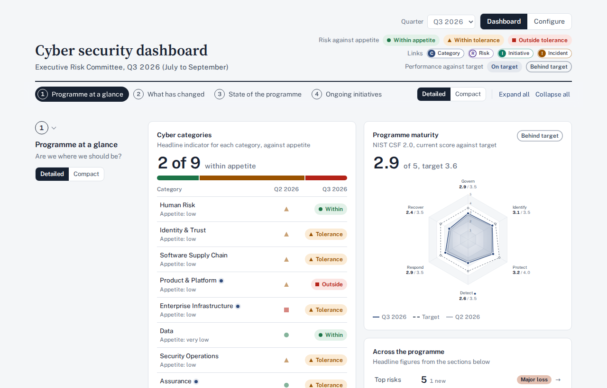
  </picture>
</p>

---

## Contents

- [Why this exists](#why-this-exists)
- [Quick start](#quick-start)
- [The dashboard](#the-dashboard)
- [Configuration](#configuration)
- [Storage and reset](#storage-and-reset)
- [Sample data](#sample-data)
- [Development](#development)
- [Security and privacy](#security-and-privacy)
- [Limitations and roadmap](#limitations-and-roadmap)
- [Licence](#licence)

## Why this exists

Boards and executive risk committees care about protecting revenue, clients and regulatory standing. They are rarely security experts. This dashboard presents cyber risk in the terms they use:

- **Categories measured against a board-approved appetite**, not raw tool metrics.
- **What changed since last quarter**, with the reason shown when someone has written one.
- **Quantified loss shown as buckets**, so the scale is clear without false precision.
- **The work under way to reduce risk**, linked to the risks it addresses.

The same layout every quarter means the board learns to read it once.

<p align="center">
  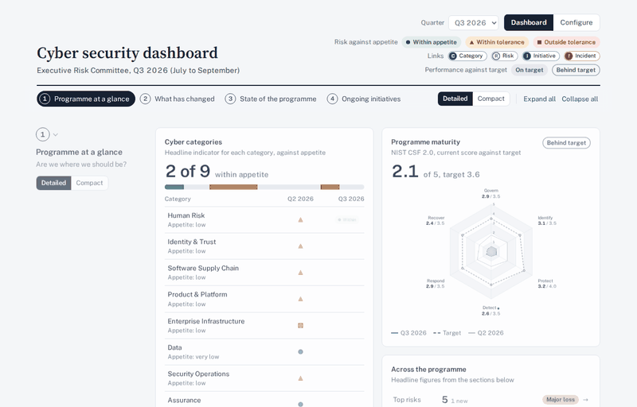
</p>

## Quick start

```bash
git clone https://github.com/<your-username>/ExecDash.git
cd ExecDash
python3 -m http.server 8000
```

1. Open <http://localhost:8000>.
2. Choose **Load sample data**, or **Set up an empty dashboard** to start from scratch.

> [!TIP]
> To host it, turn on **GitHub Pages** for the `main` branch, root folder. The dashboard is then served at `https://<your-username>.github.io/ExecDash/`.

## The dashboard

The page has four sections. Each one collapses when you press its number, and a pinned bar at the top jumps between them.

Every section has a **Detailed** and a **Compact** view. Each section's choice is remembered, and the pinned bar switches all four at once.

| Section | Question it answers | What it shows |
|---|---|---|
| **1. Programme at a glance** | Are we where we should be? | Each cyber category against appetite, maturity against target on a NIST CSF 2.0 radar, and a summary of top risks, exposure, incidents and initiatives |
| **2. What has changed** | What is new or moving? | Top risks with movement and loss bucket, combined loss exposure, exposure against appetite, and incidents |
| **3. State of the programme** | How is each category doing? | A gauge per category with appetite bands, subcategory status and trend |
| **4. Ongoing initiatives** | What is reducing the risk? | Progress, projected impact, avoided loss against cost, delivery status and linked risks |

### Programme at a glance

- **Categories against appetite:** where each category stands this quarter and last.
- **Maturity:** a NIST CSF 2.0 radar in Detailed view, or bars against target in Compact view.
- **Across the programme:** a summary of top risks, exposure, incidents and initiatives. Each row links to its section.

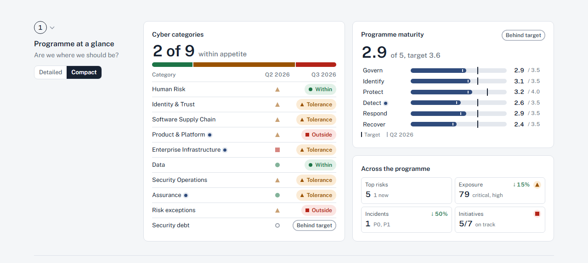

### What has changed

- **Top risks:** each carries a simplified FAIR loss estimate, shown as a loss bucket.
- **Combined tile:** simulates the top risks together and shows the expected bucket. The 1 in 10 year bucket is hatched when it is higher.
- **Exposure:** shows open critical and high vulnerabilities for Application and Infrastructure, with an appetite status for each severity that has limits set. All severities are logged, and the number shown is configurable.
- **Incidents:** shows counts for the top priorities (P0 and P1 by default), plus a list of notable incidents. Each notable incident is linked to a cyber domain or a risk, and its description is shown on hover.
- **Movement:** exposure and incident changes are shown as a percentage.

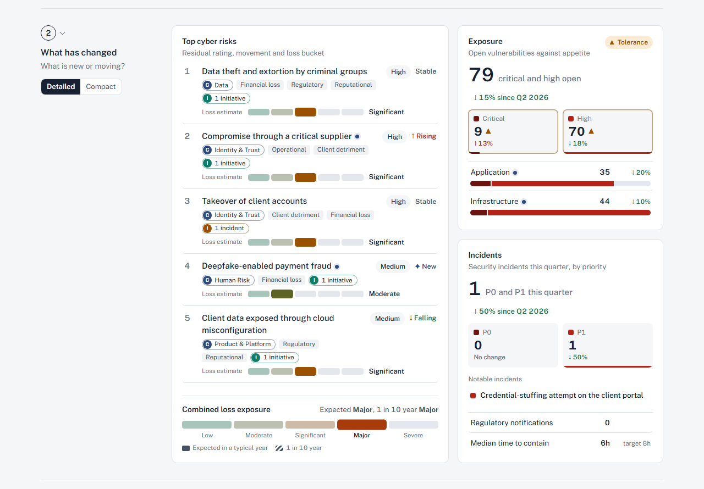

### State of the programme

Every category gets a gauge with its own appetite and tolerance bands. The highlight chips fade non-matching cards without moving anything, and a category's initiative chip jumps to its initiatives.

<table>
  <tr>
    <td width="50%" valign="top">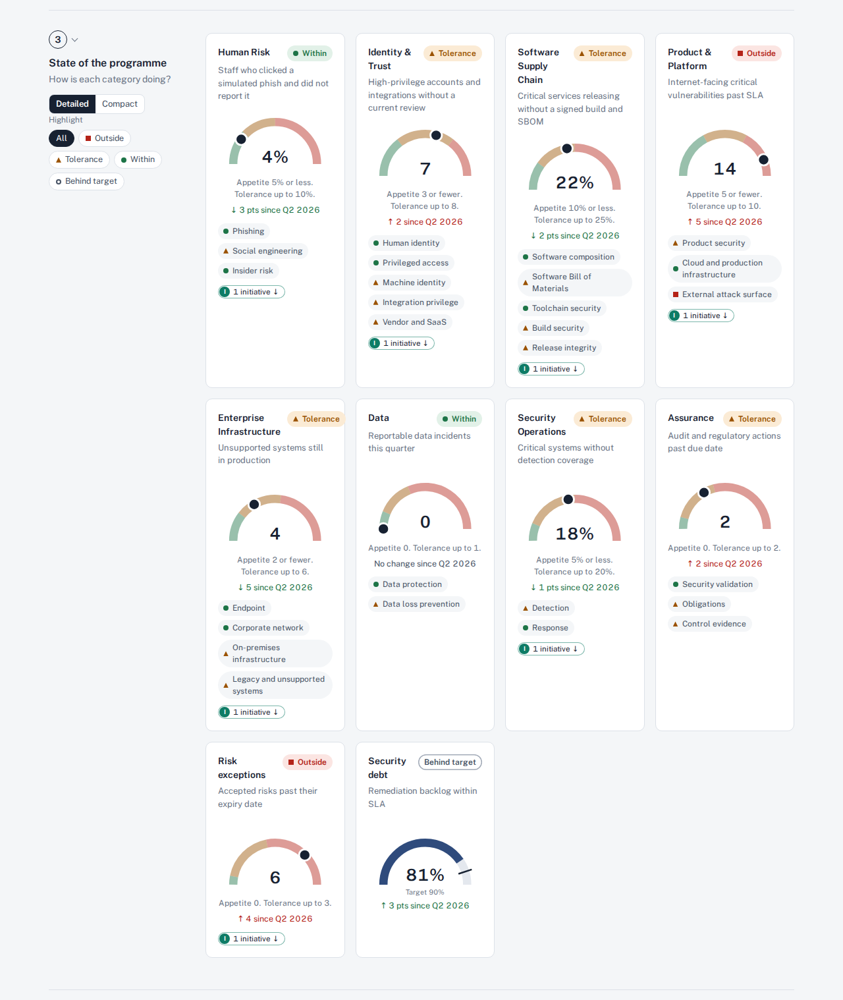</td>
    <td width="50%" valign="top">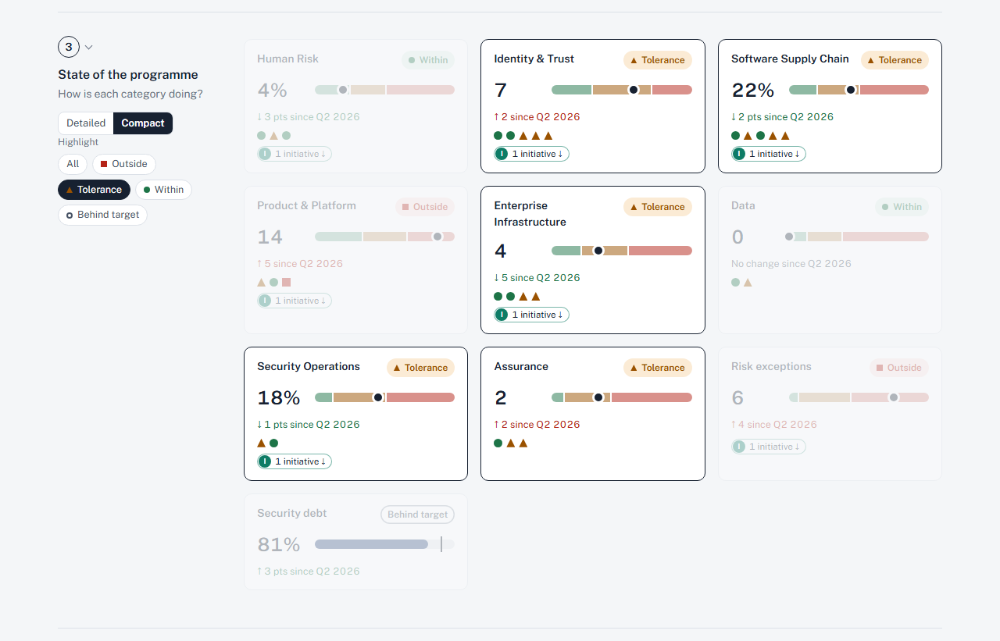</td>
  </tr>
  <tr>
    <td align="center"><sub>Detailed view</sub></td>
    <td align="center"><sub>Compact view, highlighting categories within tolerance</sub></td>
  </tr>
</table>

### Ongoing initiatives

Each initiative shows:

- progress against last quarter
- delivery status and any linked risks (links are optional)
- its projected impact, in context: the category and indicator it moves, the value now and when delivered, and where that lands against appetite
- its projected value: avoided loss a year against cost, calculated from the linked risks' loss estimates. This is avoided loss, not a measure of overall cyber improvement
- its projected value: avoided loss a year against cost, calculated from the linked risks' loss estimates. This is avoided loss, not a measure of overall cyber improvement

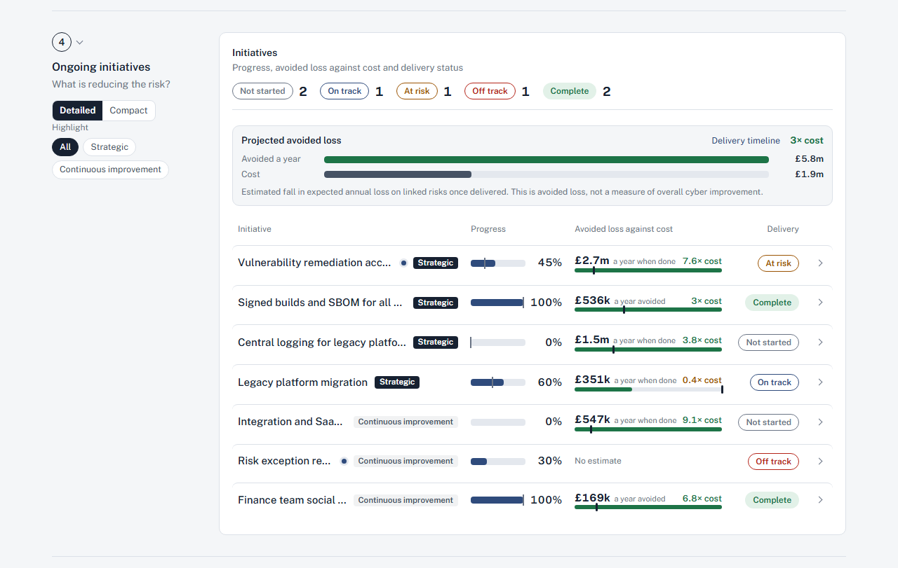

### Links and detail on hover

Wherever a category, risk, initiative or incident is referenced from another item, it uses the same chip with a letter badge: C, R, I or !. A risk chip shows its top risk rank when it has one. Attributes such as impact and initiative type use a plain style, and the header includes a key.


Tiles stay uncluttered. Hovering or focusing an item shows:

- previous values and change
- limits and loss estimates
- linked items
- a **What changed** note, when one has been written
- the description, for incidents

Hovering a risk highlights the initiatives and incidents linked to it, and hovering either of those highlights the risk.

<table>
  <tr>
    <td width="50%" valign="top">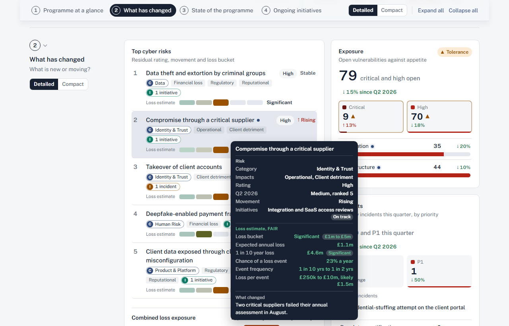</td>
    <td width="50%" valign="top">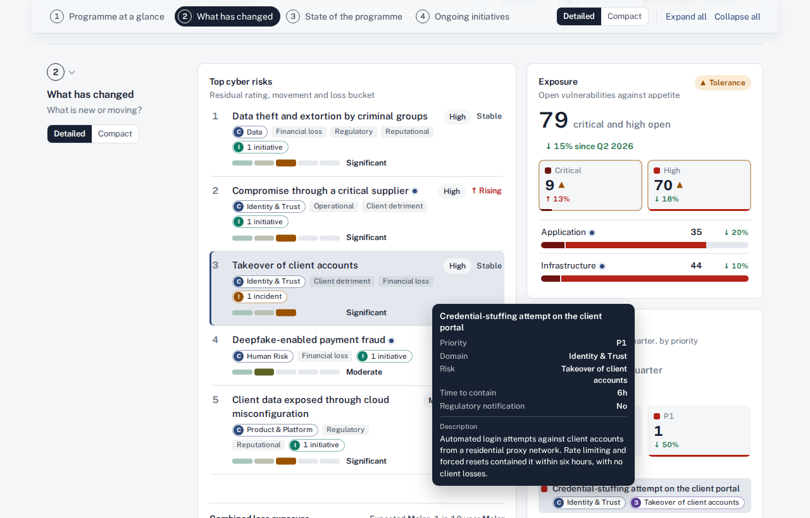</td>
  </tr>
  <tr>
    <td align="center"><sub>A top risk, with linked initiatives and commentary</sub></td>
    <td align="center"><sub>A notable incident, with its description and linked risk highlighted</sub></td>
  </tr>
</table>

### Collapsed sections, dark mode and mobile

<table>
  <tr>
    <td width="60%" valign="top">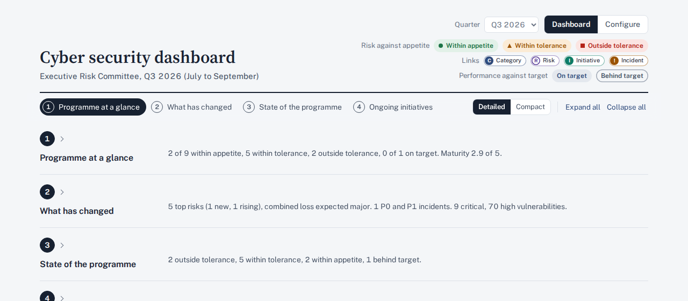</td>
    <td width="20%" valign="top">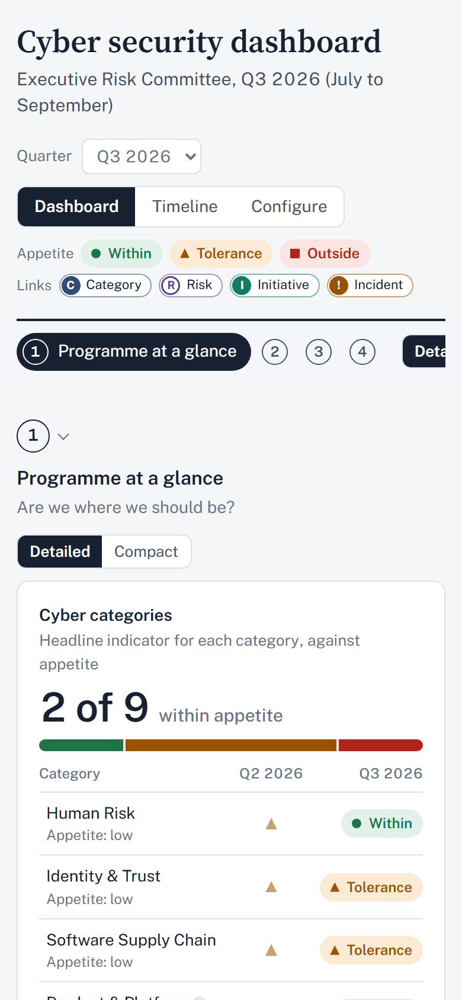</td>
    <td width="20%" valign="top">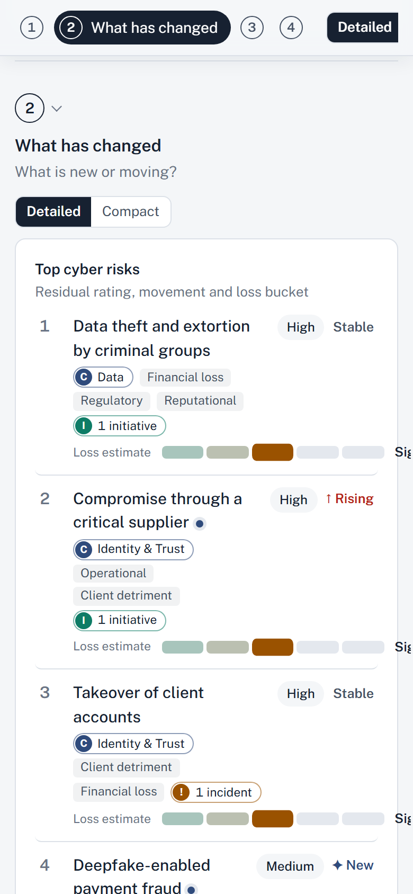</td>
  </tr>
  <tr>
    <td align="center"><sub>Collapsed sections show a one-line summary</sub></td>
    <td align="center" colspan="2"><sub>Responsive down to phone width</sub></td>
  </tr>
</table>

The page follows the system light or dark setting and respects reduced motion. Status is always shown by shape as well as colour.

**Appearance** under Structure sets the following, all previewed live:

- accent colour
- colour-blind safe status colours
- theme
- heading font
- corners
- spacing
- animation

## Configuration

Switch to **Configure** in the header. Changes are held until you press **Save changes**.

| Tab | Purpose |
|---|---|
| **Quarter data** | Values for the selected quarter, each with last quarter's figure, plus commentary on anything that changed and a list of notable incidents |
| **Structure** | Categories (with a show on dashboard switch), indicators and limits, subcategories, maturity functions, loss bands, incident priorities, exposure groups and appetite, and appearance |
| **Risks and initiatives** | Two registers with enable switches, filters, tags, bulk actions, loss estimates and optional links |
| **Quarters** | Add a quarter (blank or copied forward), delete one, and choose which the dashboard opens on |
| **Data** | Export and reset cards for each part of the data (resets ask for confirmation), previewed imports and a data health check |

<table>
  <tr>
    <td width="50%" valign="top">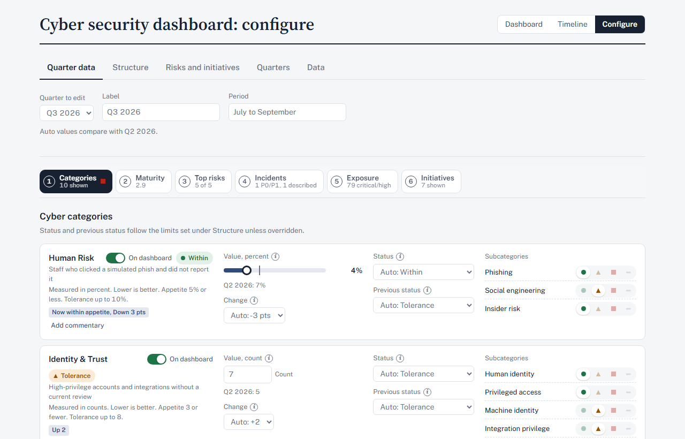</td>
    <td width="50%" valign="top">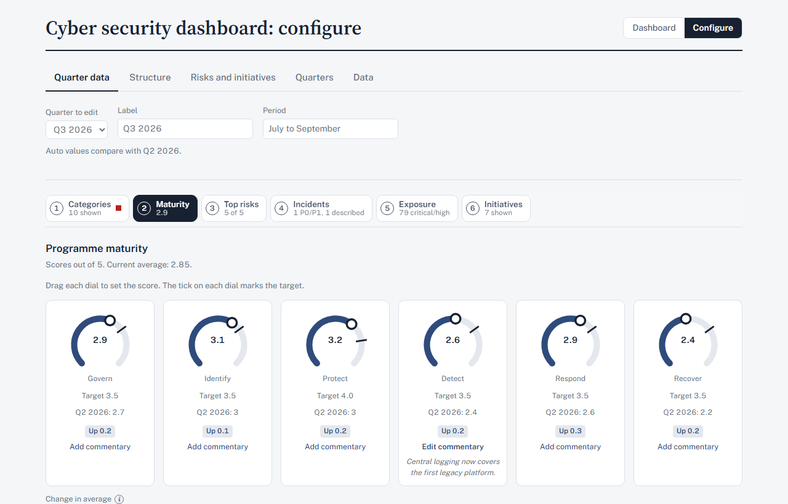</td>
  </tr>
  <tr>
    <td align="center"><sub>Quarter data: one card per category, sliders shaded by appetite zone</sub></td>
    <td align="center"><sub>Maturity scores set with dials</sub></td>
  </tr>
  <tr>
    <td valign="top">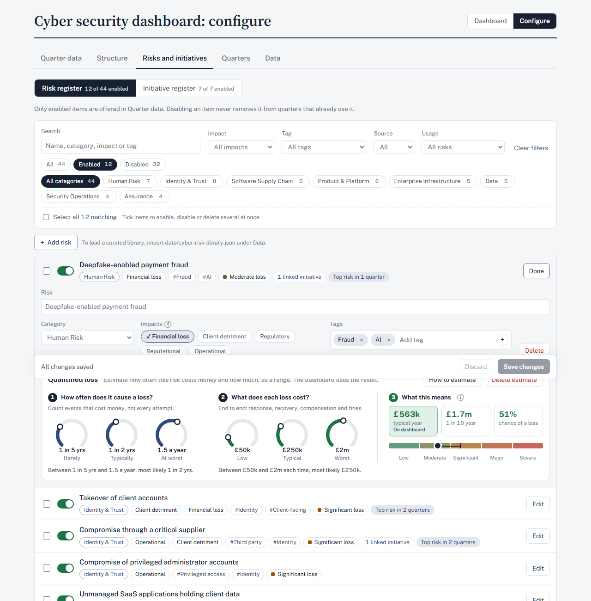</td>
    <td valign="top">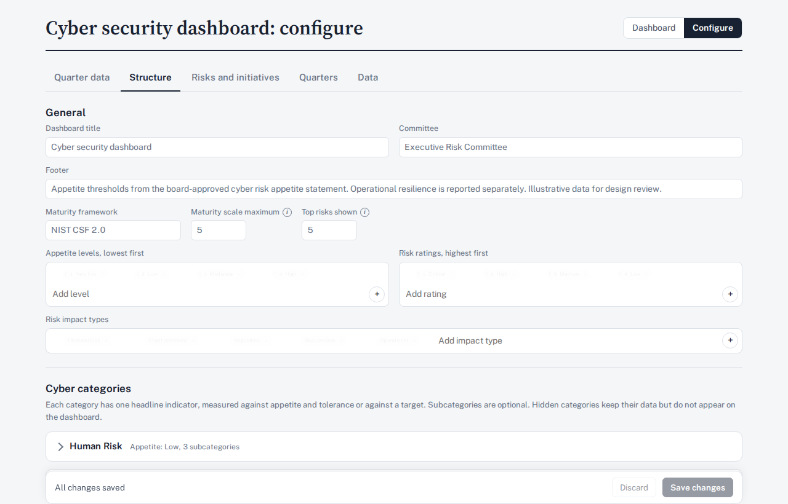</td>
  </tr>
  <tr>
    <td align="center"><sub>Risk register with a loss estimate set by dials</sub></td>
    <td align="center"><sub>Structure: lists edited as tags</sub></td>
  </tr>
</table>

<table>
  <tr>
    <td width="50%" valign="top">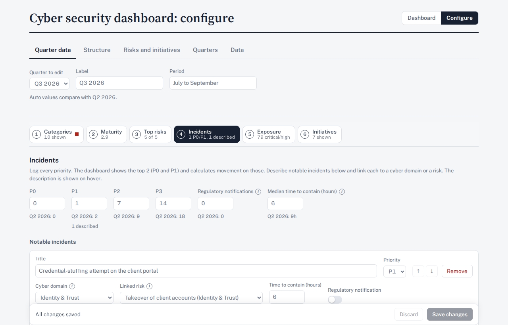</td>
    <td width="50%" valign="top">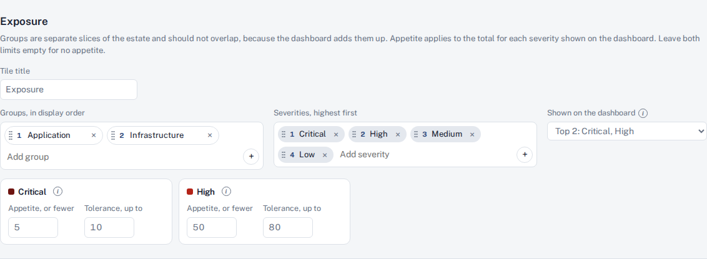</td>
  </tr>
  <tr>
    <td align="center"><sub>Notable incidents with links and descriptions</sub></td>
    <td align="center"><sub>Exposure groups and appetite by severity</sub></td>
  </tr>
</table>

<p align="center">
  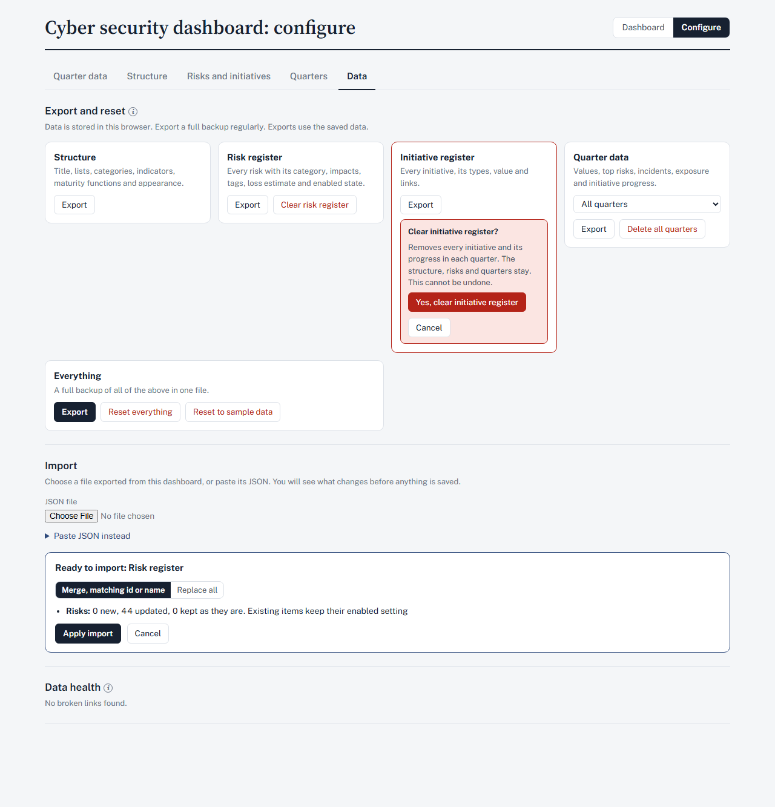<br>
  <sub>Data: exports, a previewed import and the factory reset</sub>
</p>

### Field conventions

| Kind of value | Control |
|---|---|
| Percentages | Slider, shaded by the category's appetite zones where relevant |
| Maturity scores, money, event frequency | Dial |
| Counts and hours | Number field |
| Lists (ratings, severities, impact types, tags) | Tags, reordered by dragging or with Alt and an arrow key |
| Named items (subcategories, groups, initiative types) | Editable tags |
| Subcategory status | Three-way shape picker (within appetite, within tolerance, outside tolerance) |
| On or off | Switch |
| Several choices, such as a risk's impacts | Toggle chips |
| Anything that needs explaining | An information icon with a short description |

## Storage and reset

All data lives in the browser's local storage, on the device where it was entered. Nothing is sent anywhere.

> [!IMPORTANT]
> Clearing site data removes the dashboard. Export a full backup regularly from **Configure, Data**. To move the dashboard to another browser, import that backup there.

**Resets.** Under **Configure, Data**, each part of the data has one card with Export and, where relevant, a reset button. Every reset asks for confirmation:

- **Clear risk register**, **Clear initiative register** or **Delete all quarters** reset one part and keep the structure, so you can load your own data.
- **Reset everything** deletes the structure, both registers, every quarter and the view preferences.
- **Reset to sample data** does the same, then reloads the sample.

**Data health.** Deleting something that other items link to is protected:

- Delete buttons say what is linked.
- Categories can move their links to another category.
- Saving cleans up any links left behind.
- The Data health check lists and fixes anything that remains.

**Opening from disk.** Opening `index.html` straight from disk works, but browsers block the sample data request on `file://`. In that case import `data/sample-backup.json` instead.

## Sample data

| File | Contents |
|---|---|
| [`data/sample-backup.json`](data/sample-backup.json) | Full backup with two quarters (Q2 and Q3 2026), ten categories, 44 risks, seven initiatives, notable incidents and exposure appetite |
| [`data/cyber-risk-library.json`](data/cyber-risk-library.json) | 44 common financial services cyber risks mapped to the category taxonomy, all disabled by default |

All figures, names and commentary in the sample data are illustrative.

The formats are documented in [docs/data-model.md](docs/data-model.md), along with how status, movement and loss estimates are calculated.

## Development

```
index.html                 Built dashboard: commit it, Pages serves it
src/index.template.html    Page shell with STYLES and SCRIPT markers
src/css/                   Styles, one file per topic, concatenated in name order
src/js/                    Script modules, concatenated in name order into one scope
scripts/build.mjs          Builds index.html from src/
scripts/screenshots.py     Regenerates docs/screenshots from the sample data
data/                      Sample backup and risk library
docs/                      Data model and screenshots
tests/smoke_test.py        Browser smoke test
CLAUDE.md                  Architecture and conventions for contributors and coding agents
```

Edit files in `src/`, then rebuild. Node 18 or later is enough, and there is nothing to install.

```bash
node scripts/build.mjs          # write index.html
node scripts/build.mjs --check  # fail if index.html is stale
```

Run the smoke test and regenerate screenshots with Playwright:

```bash
pip install playwright pillow
playwright install chromium
python tests/smoke_test.py
python scripts/screenshots.py
```

Formatting uses Prettier with the settings in `.prettierrc.json` (`npm run format`). The workflow in [`.github/workflows/check.yml`](.github/workflows/check.yml) runs the build check and the smoke test on every push and pull request.

See [`CLAUDE.md`](CLAUDE.md) for the module map, conventions and how to add sections, fields and settings.

## Security and privacy

- Keep real risk, incident and vulnerability data out of public repositories. The `.gitignore` excludes dashboard export files by default.
- Data is stored unencrypted in the browser's local storage. Anyone with access to that browser profile can read it.
- Imports are validated and sanitised, and user text is escaped before rendering.
- The only external request is for Google Fonts. Remove the link in `src/index.template.html` if needed.

## Limitations and roadmap

**Current limitations**

- **Loss estimates** are held on the risk register, so loss buckets move only when an estimate is edited.
- **Single browser:** there is no multi-user editing or audit trail. Share data by exporting and importing backups.
- **The loss model** is simplified FAIR, using triangular ranges and 5,000 simulated years. It is a communication aid, not a full quantitative assessment.

**Planned**

- [ ] Per-quarter loss estimates
- [ ] Loss appetite in money, with status on the combined exposure tile
- [ ] Category indicators derived from exposure data
- [ ] Exposure appetite per group
- [ ] Audit trail of saves
- [ ] Locking a quarter once presented
- [ ] Print and PDF view for board packs
- [ ] Data quality flags, such as large movements without commentary

## Licence

Released under the [PolyForm Noncommercial Licence 1.0.0](LICENSE).

You may use, change and share ExecDash for any noncommercial purpose. That
covers personal study, hobby projects and testing, and it covers charities,
educational institutions, public research bodies and government institutions.

Commercial use needs a separate licence from the copyright holder. If you want
to use ExecDash in or for a business, open an issue to ask about one.
